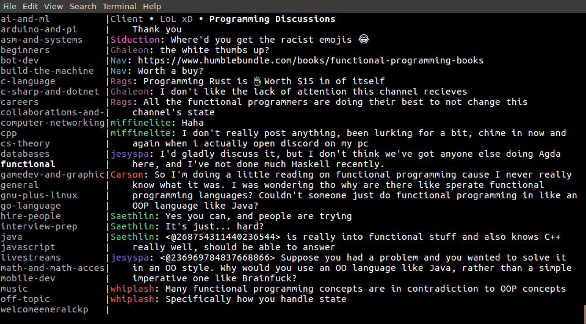

# A TUI chat client for all the things

I really dislike how much my chromebook lags while trying to use Slack, Discord, and other messaging services. This is my attempt to bring a bunch of messaging services together with a fast interface. That's currently a TUI because cross-platform GUI is hard and I mostly want to send and recieve text.

## Platforms
- [ ] Slack
  - [x] Send/Recieve basic text messages
  - [x] Send/Recieve channel and user mentions
  - [ ] Commands

- [ ] Discord
  - [x] Send/Recieve basic text messages
  - [ ] Send/Recieve channel and user mentions
  - [ ] Commands

- [ ] PushBullet
  - [ ] Send/Recieve basic text messages
  - [ ] Send/Recieve channel and user mentions
  - [ ] Commands

- [ ] Facebook Messenger
  - [ ] Send/Recieve basic text messages
  - [ ] Send/Recieve channel and user mentions
  - [ ] Commands

## TUI
- [x] Basic layout
- [x] Unread highlighting
- [x] Draw messages in a sane way
- [x] Redraw only the message area when typing (currently causes flickering)
- [x] Colored usernames
- [ ] Multi-line message editing
